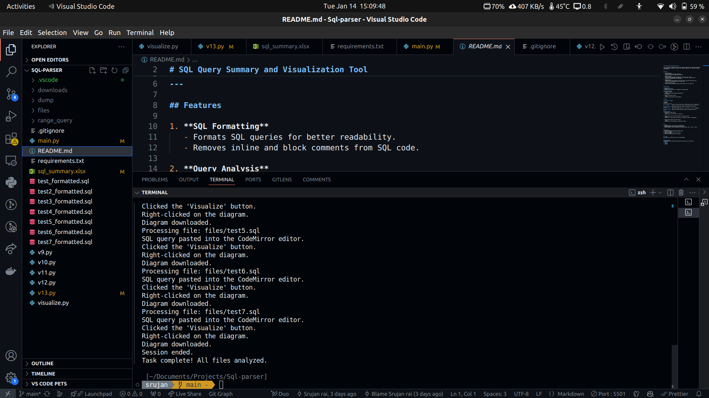
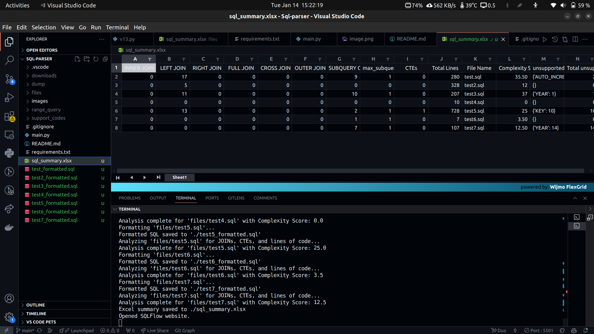
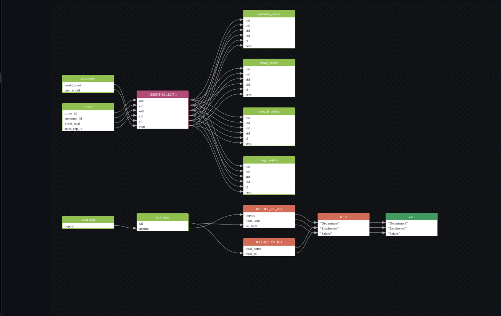

# SQL Query Summary and Visualization Tool  

<table>
<tr>
<td>

</td>
<td>
<b><i>The SQL Query Summary and Visualization Tool is a powerful application designed to enhance the readability, analysis, and optimization of SQL queries. It formats and summarizes queries, provides insights into their complexity, and generates visual diagrams to represent query flow, helping developers and analysts streamline their workflow and improve collaboration.</b>
</td>
</tr>
</table>


SQL queries often become complex as they grow in size and functionality, leading to challenges in readability, performance optimization, and debugging. Developers and analysts frequently encounter issues such as:  
- Poorly formatted or undocumented SQL queries that hinder collaboration.  
- Difficulty in understanding query structure and components like joins, subqueries, or CTEs.  
- Lack of tools to visualize query flow, making it hard to optimize queries or identify bottlenecks.  
- The absence of an automated system to generate meaningful summaries and assess query complexity across multiple queries.  

## What We Are Solving  

This tool addresses the following key challenges:  
1. **Enhancing Query Readability**: By automating SQL formatting, it ensures that queries are more readable and maintainable.  
2. **Providing Deep Insights**: Analyzing queries to extract useful metrics like the number of joins, subqueries, or nesting levels helps in evaluating query complexity.  
3. **Visualization**: Creating diagrams to represent the flow of queries visually aids understanding and optimization.  
4. **Automated Reporting**: Generating Excel-based summaries for multiple queries saves time and aids in documentation and decision-making.  

---

## Objectives  

1. **Improve Query Documentation**: Automatically format and summarize SQL queries to enhance clarity.  
2. **Assist Query Optimization**: Provide insights into query components and complexity to identify performance bottlenecks.  
3. **Enable Visual Query Representation**: Generate diagrams that represent query logic and flow.  
4. **Facilitate Batch Processing**: Allow users to analyze multiple queries simultaneously and save the outputs efficiently.  

---
## Limitation

As we are in evaluation phase, we are taking the advantage of "SQLflow not validating the users emailID" by creating random unique email for every run to visualize the SQL query.
For Production we strongly recommend using the purchased license of SQLFlow.

---

## Features  

### 1. **SQL Formatting**  
- Reformats SQL queries to improve readability.  
- Removes inline and block comments to focus on query logic.  
- Adheres to consistent coding styles.  

### 2. **Query Analysis**  
- Counts keywords like `SELECT`, `JOIN`, `WHERE`, etc., to assess complexity.  
- Identifies components such as:  
  - **JOIN types** (INNER, LEFT, RIGHT, FULL).  
  - **Common Table Expressions (CTEs)** and their usage.  
  - **Subqueries** and their nesting levels.  
- Assigns a **complexity score** based on identified components.  

### 3. **Visualization**  
- Automates query diagram creation using Selenium.  
- Compatible with web-based visualization tools (e.g., dbdiagram.io).  
- Downloads visual diagrams as image files or PDFs.  

### 4. **Excel Summary Generation**  
- Summarizes query metrics (e.g., number of joins, tables, complexity score) into an Excel file.  
- Provides aggregated insights for bulk analysis of SQL queries.  

---

## Technical Details  

### **Core Components**  

1. **SQL Parsing and Formatting**:  
   - Uses the `sqlparse` library to parse and reformat SQL queries.  
   - Strips comments and ensures consistent query formatting.  

2. **Keyword and Component Analysis**:  
   - Regular expressions and string parsing to detect SQL keywords, joins, subqueries, and nesting.  

3. **Complexity Scoring**:  
   - Assigns scores based on factors like the number of tables joined, subquery levels, and query length.  

4. **Visualization Automation**:  
   - Uses Selenium to interact with web-based tools for creating query diagrams.  
   - Supports headless browser execution for automation in CI/CD pipelines.  

5. **Excel File Creation**:  
   - Uses `pandas` to organize query metrics into structured data.  
   - Exports the data to an Excel file for easy sharing and reporting.  

---
  
*Figure 1: Tool Overview – This image provides a snapshot of the CLI interaction with the tool.*

  
*Figure 2: Query Summarization Output – This image displays the summarized output of the SQL queries.*

  
*Figure 3: Query Analysis Visualization – This image highlights the visual representation of SQL query flow, enabling better understanding and optimization.*

---
## Installation  

### Prerequisites  
- **Python 3.10 or later**.  
- Compatible browser driver (e.g., ChromeDriver for Google Chrome).  

### Installation Steps  
1. Clone the repository:  
   ```bash  
   git clone https://github.com/Srujan-rai/Sql-parser  
   cd Sql-parser  
   ```  
2. Install required libraries:  
   ```bash  
   pip install sqlparse pandas selenium argparse  
   ```  

---

## Usage  

### **Command-Line Arguments**  

| Argument             | Description                                                                                     |  
|----------------------|-------------------------------------------------------------------------------------------------|  
| `-s, --source`       | Path(s) to the source SQL file(s). Accepts multiple files. **(Required)**                       |  
| `-d, --destination`  | Destination directory for output files. Defaults to the current directory.                      |  
| `-type, --type`      | Specify the database type (`mysql`, `postgresql`, `oracle`). **(Required)**                     |  
| `-graph, --graphs`   | Enable query diagram generation. Requires a compatible browser and driver.                      |  

### Example Usage  

1. **Basic Analysis**:  
   ```bash  
   python main.py --source queries.sql --type mysql  
   ```  

2. **Analyze Multiple Files**:  
   ```bash  
   python main.py --source query1.sql query2.sql --destination ./output --type postgresql  
   ```  

3. **Generate Query Diagrams**:  
   ```bash  
   python main.py --source queries.sql --type mysql --graphs  
   ```  

---

## Outputs  

1. **Formatted SQL**: A new file with the reformatted query.  
2. **Analysis Summary**:  
   - Excel file summarizing metrics like join types, nesting levels, and complexity scores.  
3. **Query Diagrams**: Visual representations of query flow, saved as images or PDFs.  

---
[Watch the Demo Video](https://youtu.be/7zZRi566erY)
---
## Roadmap  

1. **Database Integration**: Allow direct analysis of queries fetched from live databases.  
2. **Advanced Complexity Metrics**: Incorporate execution cost and database-specific optimization metrics.  
3. **Interactive Visualizations**: Enable dynamic exploration of query diagrams.  
4. **Query Optimization Suggestions**: Provide actionable insights for improving query performance.  

---

## Contributing  

1. Fork this repository.  
2. Create a new branch (`feature/your-feature`).  
3. Commit changes and open a pull request.  

---

## License  

This project is licensed under the [MIT License](LICENSE).  

---  

## Acknowledgments  

- `sqlparse`  
- `pandas`  
- `selenium`  
- `argparse`  
